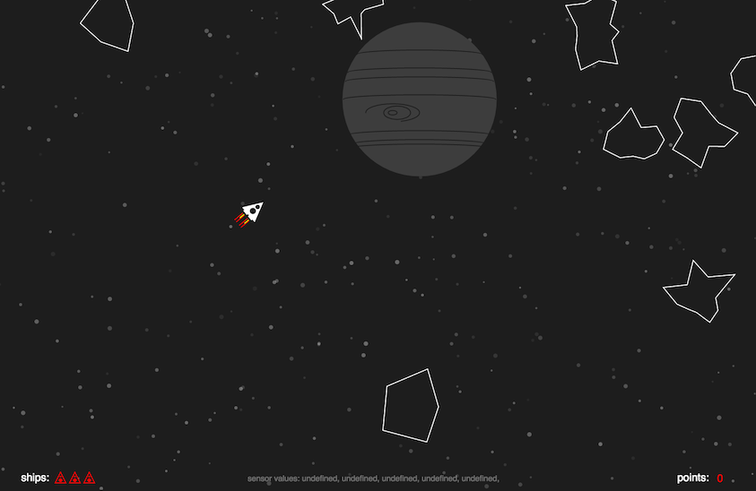
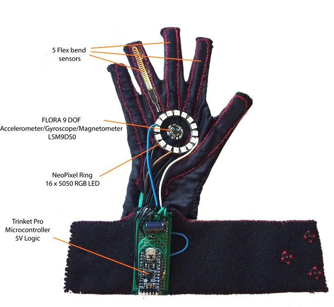

## Asteroids Game Controlled with DIY Sensor Glove



This small DIY project combines fun of game programming and super exciting capabilities of Arduino boards.

Asteroids game is loosely based on classic arcade space shooter. It is coded in JavaScript using p5.js client-side library for pleasant visual and interactive experience.

#### The Glove
The Glove designed as game controller is equipped with five bend sensors placed in fabric veins on top of each finger. Microcontroller mounted on the cuff captures movement in 3D space and sends this information via serial communication to a computer. The data is read by a simple Node.js based WebSocket server API and set as an input to a browser. The glove also includes super vibrant RGB LED ring for visual feedback.




#### Playing the Game
The objective of Asteroids game is to destroy asteroids. The player controls a triangular ship that can rotate left and right, fire shoots straight forward. To move the ship, player applies thrust in a desired direction. To collect points, asteroids need to be destroyed. To collect extra spaceships (lives) player freezes and shoots frozen asteroids.  

###### Controls:
Game as well can be controlled with keyboard.
- Middle finger/:arrow_up: - direction and thrust
- Thumb/space - shooting
- Index finger/:arrow_down: - freeze asteroids


#### Hardware
- Adafruit [Pro Trinket](https://www.adafruit.com/products/2000) Microcontroller with 5V operating logic and ATmega328 chip with 16MHz clock rate.
-  5 long Flex sensors
- Adafruit [FLORA 9-DOF](https://www.adafruit.com/products/2020) Accelerometer/Gyroscope/Magnetometer LSM9DS0
- Adafruit [NeoPixel Ring](https://www.adafruit.com/products/1463) 16 x 5050 RGB LED with Integrated Drivers - for fun :)
- FTDI to USB cable


#### Setup
After cloning the project, enter the following lines on the command-line:
```
$ npm install
$ npm start
```
#### Heroku
[Online version](https://asteroids-sensors-game.herokuapp.com)

#### Third party libraries
* p5.js JavaScript [library](http://p5js.org/download/)
* Paul Stoffregen's TimerOne [library](https://github.com/PaulStoffregen/TimerOne)

#### References
[CodingTrain](https://www.youtube.com/user/shiffman)

----

###### Things I have learnt from this project
- sewing 😃
- coding microcontrollers
- how painful sensor calibration can be
- making USB port talk to a browser
- coding fully controllable game
- generating randomly shaped asteroids on canvas
